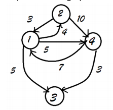

# Assignment 2 Dijkstra's Algorithm

Implement Dijkstra’s algorithm to solve Single Destination Shortest Path problem. Single destination shortest path is finding shortest path from all the vertices to the given vertex.

## Input file

- Vertices are numbered 1 to n
- First line represents number of vertices
- This is followed by a set of lines
- Each line starts with a integer (any integer from 1 to n in any order) which represents vertex number (v_id) followed by space followed by a set of d pairs where d represents outdegree of the vertex v_id .First number in the pair represents neighbour vertex id and second number weight of the edge which connects vertex to the neighbour. Weight is always a non-negative integer

## Sample Input file
```
4
1 2 4 3 5 4 5
4 1 7 3 3
2 1 3 4 10
```

## Representation




## Testing

Implemented a testing script for the program that looks at all txt files within the specified `--input` folder and pair it with the file with the file with the same name in the `--output` folder and verify that the program is running appropriately

```bash
$ python3 tests/t1.py --input inputs/ --output outputs/
Testing  inputs/1.txt outputs/1.txt
Success
Testing  inputs/2.txt outputs/2.txt
Success
```